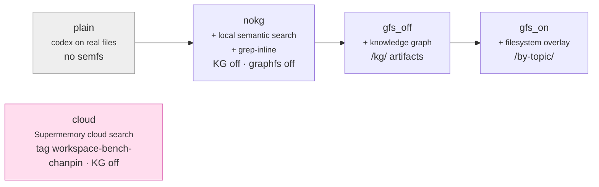
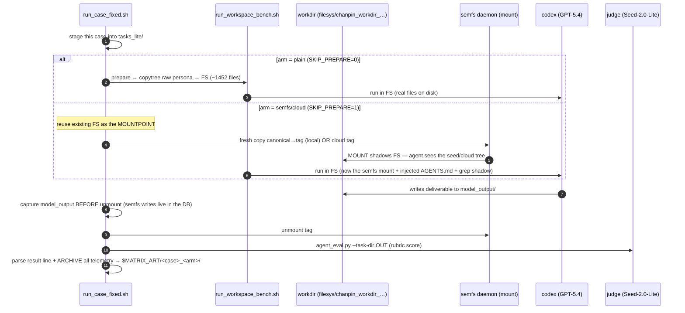
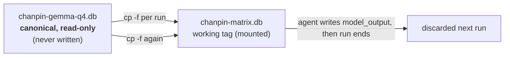
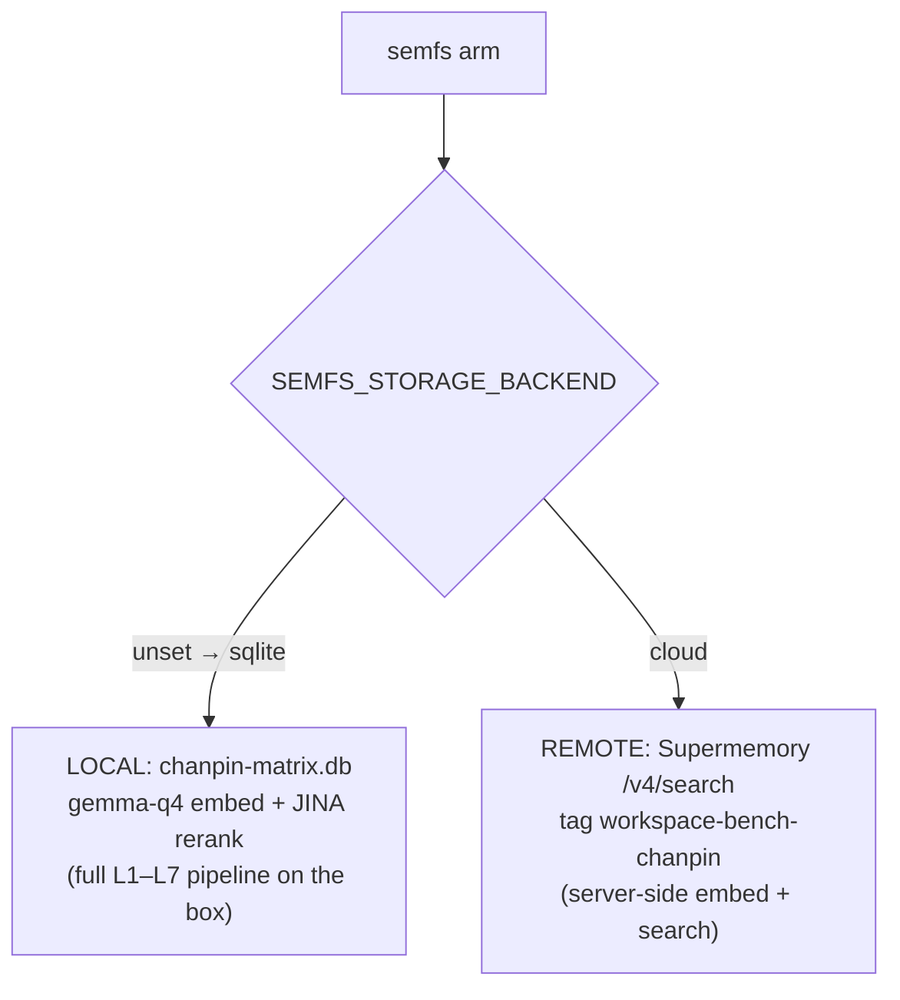

# Workspace-Bench harness — architecture & data flow

> How we benchmark **semfs** against **Workspace-Bench** on EC2. Companion to
> [`KNOBS.md`](KNOBS.md) (every env knob), [`EC2_RUNBOOK_CURRENT.md`](EC2_RUNBOOK_CURRENT.md)
> (how to run), and the core-product [`../../docs/ARCHITECTURE.md`](../../docs/ARCHITECTURE.md).
> Diagrams are [Mermaid](https://mermaid.js.org/).

---

## 0. The hypothesis we're testing

> **semfs reduces an agent's token usage while maintaining or improving accuracy** — by
> serving *semantic retrieval + extracted text* as an ordinary folder, so the agent stops
> crawling (`os.walk`/`find`) and stops shelling out to parse binaries (the "format trap").

The benchmark is **Workspace-Bench**: an agent (codex / GPT-5.4) is dropped at the root of a
simulated employee's full workspace (~1452 files for the `产品人员`/PM persona) and given a
task; a rubric judge (Seed-2.0-Lite) scores the deliverable. We measure **tokens, tool-calls,
wall-time, and rubric score** per run.

---

## 1. The honest-A/B principle (the one rule that keeps results valid)

**Every arm sends the byte-identical task prompt.** semfs is never allowed to change the
prompt the baseline gets. All of semfs's help must arrive **through the product**:

- the **mount** (files presented semantically),
- the injected **`AGENTS.md`/`CLAUDE.md`** hint (written by `semfs mount`, see core arch §6),
- the **`grep` shadow** (a flagless `grep` inside a mount routes to `semfs grep`).

If help came from harness-only prompt text, the comparison would be gamed. This is why, e.g.,
the `nokg` arm differs from `gfs_off` only in *what the product injects/materializes*, not in
the task text. (See `EC2_RUNBOOK_CURRENT.md` §0.)

---

## 2. The arm ladder — each adds exactly one capability



| arm | storage | KG (`/kg/`) | graph-fs (`/by-topic/`) | what it isolates |
|---|---|---|---|---|
| `plain` | — (real disk) | — | — | the baseline ceiling |
| `nokg` | local sqlite | off | off | value of search + grep-inline alone |
| `gfs_off` | local sqlite | **on** | off | marginal value of the knowledge graph |
| `gfs_on` | local sqlite | on | **on** | marginal value of the `/by-topic/` overlay |
| `cloud` | **Supermemory cloud** | off | off | local-index vs cloud-index retrieval |

All semfs arms also run with `SEMFS_GREP_INLINE=on`, `RETURN_MODE=snippet`,
`RESULT_LIMIT=8`, `SEARCH_ONLY=on`, `REWRITE=1` (see [`KNOBS.md`](KNOBS.md)).

`cloud` is a *different corpus snapshot* (the `workspace-bench-chanpin` container, ~74%
coverage, Supermemory's own embeddings **with `.extracted.md` summaries indexed**) — a
legitimate cloud baseline, **not** a byte-matched A/B against the local gemma-q4 seed.

---

## 3. Per-case data flow (one run)



`★ The mount-shadows-workdir insight ─────────`
For semfs arms, the FUSE mount sits **on top of** the staged workdir and **shadows** it — the
agent reads file content from the **seed DB**, never the copied bytes. Two consequences:
1. The `copytree` (`prepare`) is **pure waste for semfs arms** → `SKIP_PREPARE=1` skips it
   (the mount only needs the mountpoint dir to exist). This is the ~6-min/run bottleneck fix.
2. The agent's `model_output` deliverable goes **into the mount/DB**, not the underlying disk,
   so it must be captured **before unmount** (and before the next fresh-copy wipes the tag).
`──────────────────────────────────────────────`

---

## 4. Contamination model — why fresh copies, not deletes

Each semfs run writes the agent's `model_output` into the mount → the seed DB. Left in place,
a prior run's output leaks into the next run's index (case-289 fabrication trap). The fix:



**Fresh-copy-per-run makes contamination structurally impossible** — nothing persists between
runs, and the canonical seed is never mutated (satisfies "keep all seeds intact"). This
replaced an earlier raw-SQL `DELETE FROM chunks` cleanup that **desynced the FTS5/vec0
companion indexes** (deleting `chunks` rows orphaned their `ffts`/`vchunks` rows → search
returned 0). Lesson encoded here: never raw-`DELETE` from the search index; copy clean instead.
(`cloud` uses the `workspace-bench-chanpin` container directly — its search is remote, so
local `model_output` can't pollute it.)

---

## 5. Local vs cloud routing



This axis — **not** the embedder — decides local vs cloud (core arch §3). Local arms run the
whole search pipeline on the 4-vCPU box (and pay FUSE round-trip latency on every file op);
the cloud arm offloads search to Supermemory (fast: ~1.8s/query, no local embedding).

---

## 6. Telemetry capture — nothing is lost

After every run, `$MATRIX_ART/<case>_<arm>/` gets:

| artifact | source | what it is |
|---|---|---|
| `output/raw/` | harness | codex stdout trace, chat-adapter log, invocation, last_message |
| `output/*judge*.json` | judge | per-rubric pass/fail + summary |
| `output/agent.json` | harness | totalTokens / turns / status |
| `telemetry/` | harness `TELEMETRY_ROOT` | workspace snapshots (before/after prepare/run), prepare/run **diffs**, `timing_breakdown.json`, narrative |
| `model_output/` | captured pre-unmount | the agent's actual deliverable (xlsx/docx/…) |
| `run.log` | driver | full per-run stdout |

The harness keys its own telemetry dir by `RUN_STAMP` (unique per case,arm) so it doesn't
clobber; the `output/<label>/<case>/` dir **does** clobber across same-case semfs arms (shared
label), which is why the driver copies everything out per (case,arm) immediately.

---

## 7. Result schema

One JSON line per run in `$MATRIX_RESULTS`:

```json
{"case":"15","arm":"plain","wall_sec":428,"tokens":184569,"turns":1,
 "status":"passed","tool_calls":8,"cached_input":0,"input_tokens":181489,
 "output_tokens":3080,"passed":6,"total":16,"judge_err":null}
```

`passed/total` = rubric score; `tokens`/`tool_calls` from the codex trace; `cached_input` is
OpenRouter prompt-cache reuse (0 here — single-turn, no prefix reuse).

---

## 8. Known caveats (read before quoting numbers)

- **n=1 per cell is noisy.** Same-arm reruns have swung wildly (e.g. `gfs_on` case-15:
  1/16 @171K vs 3/16 @666K; `cloud`: 4/16 vs 1/16). codex exploration is stochastic and
  FUSE/API latency compounds it. **Trust the ordinal pattern across cases, not per-cell
  numbers.** Quote a cell only with 2–3 repeats.
- **Structural rubrics are unwinnable** for the chanpin persona (rubrics expecting `./data`,
  `./output_cc`, a `metadata.json` meta-task) — the persona layout doesn't match them, so the
  ceiling is well below 16/16 for *every* arm including plain.
- **Production/authoring tasks** (build an xlsx, e.g. case 15) are semfs's worst fit: the
  agent needs exact binary structure, which extracted *text* loses — plain (real files) wins.
  Retrieval/QA tasks are where semfs should pay off.
- **Cloud ≠ matched A/B** — different container, embeddings, coverage, and it has summaries
  the local seed lacks (§2).

---

## 9. Files

| file | role |
|---|---|
| `run_case_fixed.sh` | one `(case, arm)` run: stage → mount/prepare → agent → judge → archive |
| `run_pm_matrix_5arm.sh` | the 5-arm × 5-case serial matrix driver |
| `KNOBS.md` | every env knob (core + harness) with defaults |
| `EC2_RUNBOOK_CURRENT.md` | how to run, box access, gotchas |
| (box) `/tmp/run_case_fixed.sh`, `/tmp/run_pm_matrix_5arm.sh` | deployed copies |
| (box) `/srv/semfs-benchmark/matrix_artifacts/run5arm/` | archived telemetry per (case,arm) |

---

## 10. Open follow-ups

- **"local + summaries" arm** — the cloud arm beat local semfs on case 15, likely because its
  index has `.extracted.md` summaries while the local gemma-q4 seed serves raw chunks. Adding
  per-doc summaries to the local seed is the strongest lever to test next.
- **2-way parallelism** — feasible via a lightweight symlinked second `WB_ROOT` (real
  `tasks_lite`/`.generated`/`output`/workdir, symlinked read-only `src`/masters) + per-worker
  container tag + serialized cloud arm (singleton tag). Deferred: setup cost ≈ runtime saved
  for a one-off matrix; worth it once we iterate many matrices. Disk is the constraint (93%
  full; ~90G is unused `research_*`/`kaifa_*` personas that could be freed).
- **2–3 repeats per cell** for any quotable number (see §8).
