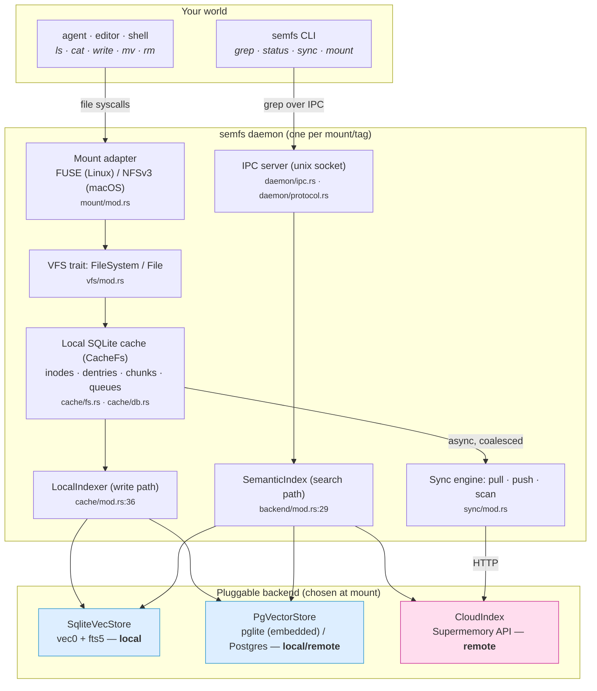
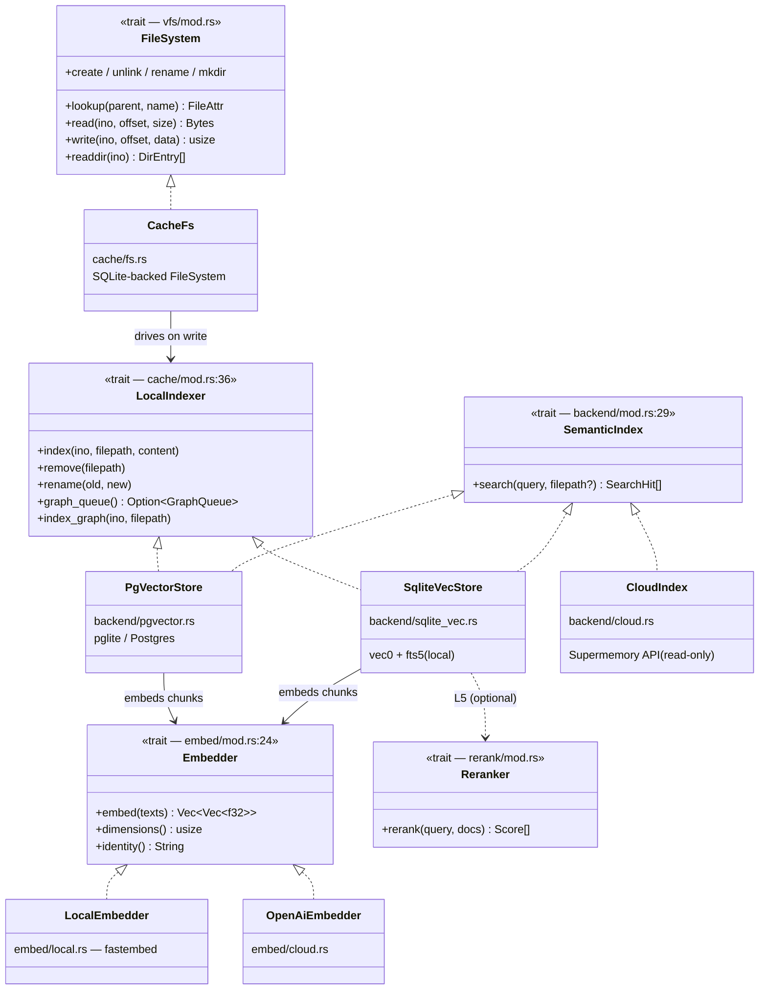
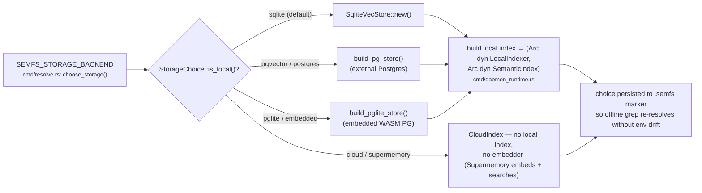
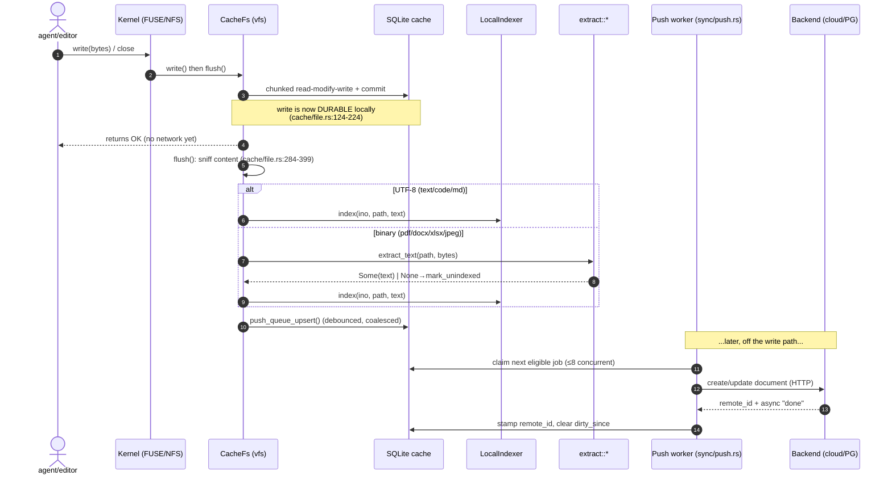
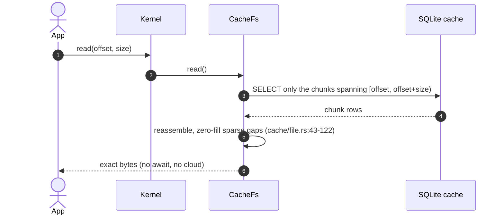
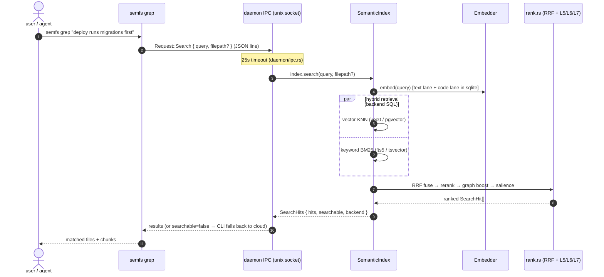
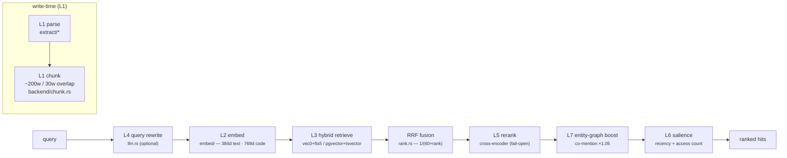
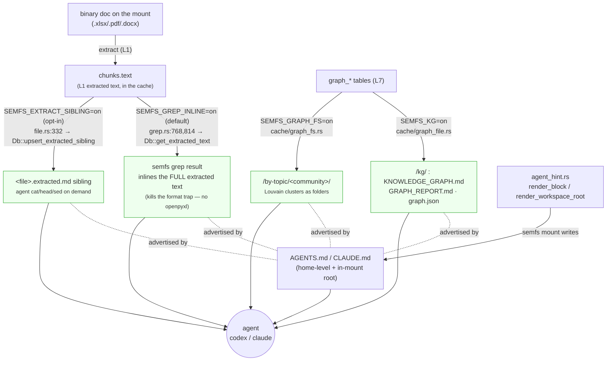
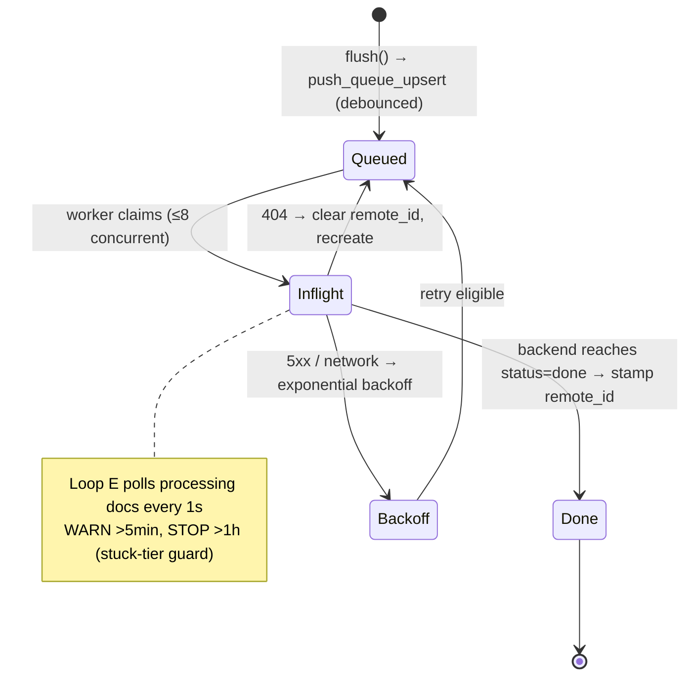

# semfs — Architecture & Documentation Index

> **Start here.** This is the single entry point to the `semfs` codebase: a guided
> architecture overview with UML diagrams, plus a map of every other doc in the repo.
>
> `semfs` ( **sem**antic **f**ile**s**ystem ) mounts an agent's memory as an ordinary
> folder — `ls` it, `cat` it, write to it, and `grep` it **by meaning** — backed by a
> storage tier you choose (local SQLite, embedded/external Postgres, or a cloud memory
> service), swapped at mount time without the agent or your tools noticing.

All diagrams below are [Mermaid](https://mermaid.js.org/); GitHub and most editors render
them inline. Every component is annotated with its `path:line` so you can jump from the
picture straight to the code.

---

## Why semfs exists (the problem)

An LLM agent is **stateless** — it forgets everything between runs. Giving it a durable,
useful memory has, until now, meant solving three problems at once:

1. **No persistence.** The agent needs somewhere to keep what it learns and re-read it later.
2. **Integration tax.** Bolting memory onto an agent normally means a **bespoke SDK or tool
   schema** for every harness (Claude Code, Codex, your own scripts) — new surface area to
   build, version, and teach the model.
3. **Exact-match search misses meaning.** Plain `grep`/keyword lookup finds the *token* you
   typed, not the *idea* you meant — so the agent can't retrieve a relevant note unless it
   already remembers the exact words.

**semfs collapses all three into one move: make memory a *folder*.** Every tool — editors,
`git`, shells, agent harnesses — already speaks files, so memory delivered as files needs **no
new SDK and no tool schema**; writes are durable the instant they return; and `semfs grep`
retrieves **by meaning**, not by exact text. The storage underneath is swappable (local SQLite,
Postgres, or a cloud service) so you are never locked into one tier.

> One line: *give an agent a memory it reads and writes as ordinary files, and can search by
> meaning — with zero new integration surface.* Everything in this document is in service of
> that. (Fuller framing: [`../README.md`](../README.md) · [`../semfs-course/`](../semfs-course/).)

---

## 0. Where to read next (doc index)

| If you want to… | Read |
|---|---|
| **Understand the product in 2 minutes** | [`../README.md`](../README.md) — pitch, quickstart, commands |
| **Learn the mental model, ELI5 → expert** | [`../semfs-course/`](../semfs-course/) — module course (`modules/01-intro.html`) |
| **See the system visually, end-to-end** | [`system-deep-dive.html`](system-deep-dive.html), [`architecture.html`](architecture.html) |
| **Understand the Rust code layout** | [`rust-architecture.html`](rust-architecture.html) **+ this file** |
| **Understand the pluggable-backend design** | [`backend-agnosticism.md`](backend-agnosticism.md), [`backend-agnosticism-design.html`](backend-agnosticism-design.html), [`backend-pipelines.html`](backend-pipelines.html) |
| **Understand semantic search (vector + BM25 + rerank)** | [`rag-deep-dive.html`](rag-deep-dive.html) |
| **See the model/embedder choices** | [`../MODELS.md`](../MODELS.md) |
| **Review requirements / test strategy** | [`requirements-analysis.html`](requirements-analysis.html), [`test-strategy.html`](test-strategy.html) |
| **Read decision records (spikes)** | [`spike3-embedder-decision.html`](spike3-embedder-decision.html), [`spike8-graph-decision.html`](spike8-graph-decision.html), [`codex-review-5-levels.html`](codex-review-5-levels.html) |
| **Track milestone progress** | [`../progress.md`](../progress.md) |
| **Understand the benchmark harness** | [`../benchmarks/workspace_bench/BENCH_ARCHITECTURE.md`](../benchmarks/workspace_bench/BENCH_ARCHITECTURE.md) + [`KNOBS.md`](../benchmarks/workspace_bench/KNOBS.md) |
| **Contribute as an agent** | [`../CLAUDE.md`](../CLAUDE.md), [`../AGENTS.md`](../AGENTS.md) |

---

## 1. The 10,000-ft view

`semfs` is a **local daemon** that presents a memory store as a real folder and answers
semantic `grep` queries. Writes are **durable locally the instant they return**, then
**drain asynchronously** to whichever backend you chose.



**Three ideas to hold onto:**

1. **Files are the API.** Every tool already speaks files; memory delivered as files needs
   no SDK. The VFS trait (`vfs/mod.rs`) is the only definition of filesystem semantics.
2. **Local-first durability.** A write commits to the SQLite cache transactionally
   (`cache/file.rs:124-224`) and *then* drains to the backend in the background
   (`sync/push.rs`). Reads never touch the network (`cache/file.rs:43-122`).
3. **Backend-agnostic.** Two trait seams — `SemanticIndex` (read) and `LocalIndexer`
   (write) — decouple search/index from storage. Swapping SQLite ↔ Postgres ↔ cloud changes
   only which struct is constructed at mount; the folder behaves identically.

---

## 2. Code map

Two crates. All logic lives in `semfs-core`; the `semfs` binary is a thin dispatch shell.

| Crate / module | Path | Responsibility |
|---|---|---|
| **`semfs`** (binary) | `crates/semfs/src/` | CLI: arg parsing + subcommand dispatch (`cmd/mod.rs`) |
| **`semfs-core`** (lib) | `crates/semfs-core/src/` | Everything below |
| `vfs` | `vfs/mod.rs` | `FileSystem` / `File` traits + `FileAttr`/`DirEntry`/`VfsError`. Pure semantics, no I/O. |
| `mount` | `mount/mod.rs` | FUSE (Linux) / NFSv3-over-localhost (macOS) behind one API. Only place that knows the kernel. |
| `cache` | `cache/{fs,file,db,graph_queue,hydration,graph_file,graph_fs}.rs` | Local SQLite store; defines `LocalIndexer`. Passive — never calls the network. Also materializes the **agent-facing surfaces** (§6): `graph_file` → `/kg/` artifacts, `graph_fs` → `/by-topic/` overlay; `file`/`db` → `.extracted.md` siblings. |
| `backend` | `backend/{mod,sqlite_vec,pgvector,cloud,chunk,rank,graph}.rs` | `SemanticIndex` trait + concrete stores; chunking (L1), ranking (L5/L6/L7), entity graph (L7). |
| `embed` | `embed/mod.rs` | `Embedder` trait: text→vector. Local (fastembed) / cloud (OpenAI/OpenRouter). A deterministic `StubEmbedder` is `#[cfg(test)]`-only — not a shipped backend. |
| `rerank` | `rerank/mod.rs` | `Reranker` trait: cross-encoder rescoring (L5). Fail-open. |
| `extract` | `extract/{mod,pdf,ooxml,spreadsheet,legacy_ppt,ocr}.rs` | Binary doc → searchable text (PDF/Office/images). Sniffs magic bytes, not extension. |
| `sync` | `sync/{mod,pull,push,scan}.rs` | Background reconcile loops between cache and cloud backend. |
| `daemon` | `daemon/{mod,client,ipc,protocol}.rs` | Daemon lifecycle + unix-socket IPC (the CLI ↔ daemon RPC). |
| `api` | `api/mod.rs` | Typed Supermemory HTTP client (retries 5xx, surfaces 4xx). |
| `config` | `config/mod.rs` | XDG paths + credentials; validates path components against traversal. |
| `agent_hint` | `agent_hint.rs` | Builds the `AGENTS.md`/`CLAUDE.md` hint injected at mount (home-level + in-mount workspace-root) that teaches the agent to use `semfs grep`, `/kg/`, `.extracted.md` (§6). |

### CLI surface (`crates/semfs/src/cmd/`)

`mount` · `unmount` · `grep` · `status` · `list` · `logs` · `sync` · `login` · `logout` ·
`whoami` · `init` · `install` — dispatched in `cmd/mod.rs`. `mount` spawns the long-running
daemon (`daemon_inner`, hidden) that owns the VFS + index for one container tag.

---

## 3. The abstraction seams (UML class diagram)

The whole "backend-agnostic" claim rests on these traits. Note that **read** and **write**
are *separate* interfaces — `LocalIndexer` lives in `cache` (not `backend`) specifically to
break a module cycle (`cache/mod.rs:24-34`).



**Read it as:** `CacheFs` is the filesystem the kernel talks to; on every write it drives a
`LocalIndexer`. Both local stores implement *both* seams (they index and they search);
`CloudIndex` is search-only (the cloud does its own indexing). `Embedder`/`Reranker` are
pluggable model interfaces with local-and-cloud implementations.

### Backend selection at mount time



**Storage — not the embedder — is the local-vs-cloud router.** `StorageChoice::is_local()` is true for
every backend except `Cloud`; a local backend builds an index (and needs a real embedder), while
`cloud` builds none and routes `grep` straight to `CloudIndex`. (Historically this decision was hidden
inside the embedder choice — a fake `hash` embedder flipped indexing off; that hack was removed. See
`tickets/remove-hash-embedder`.)

---

## 4. Data-flow sequences (UML)

### 4a. Write path — durable locally, then drained



Key invariant: **rapid saves coalesce** — a debounce + main/pending slot scheme
(`cache/db.rs:426-495`) collapses a burst into at most two backend requests per file.

### 4b. Read path — verbatim bytes, no network



### 4c. Semantic `grep` — over IPC into the chosen backend



---

## 5. The search pipeline — layers L1 → L7

`grep` is not one query; it is a staged pipeline. Stages are backend-agnostic: the *retrieval
SQL* differs per backend, but the *ranking math* (`backend/rank.rs`) is shared so SQLite and
Postgres never drift.



| Layer | Stage | Where |
|---|---|---|
| **L1** | Parse binaries → text, then chunk (verbatim windows so hits map back to lines) | `extract/` + `backend/chunk.rs` |
| **L2** | Embed text → vector (two-lane: prose 384d, code 768d) | `embed/` |
| **L3** | Store + hybrid retrieve: vector KNN **and** keyword BM25 | `backend/sqlite_vec.rs`, `backend/pgvector.rs`, `cache/db.rs` |
| **L4** | Optional LLM query rewrite | `llm.rs` |
| **L5** | Cross-encoder rerank of fused candidates (fail-open) | `rerank/` + `backend/rank.rs` |
| **L6** | File-level salience nudge: recency (14-day half-life) + log access count | `backend/rank.rs` |
| **L7** | Entity graph: LLM extracts typed entities → `/memories/*` nodes + edges; co-mentioned files boosted. **Deferred** off the write path, drained by `run_graph_worker` | `backend/graph.rs` + `cache/graph_queue.rs` |

**Fail-open ladder:** every optional stage degrades gracefully — local index build fails → SQLite
mounts fall back to cloud search (explicit pg/pglite fail the mount instead); no reranker → RRF order
stands; no graph LLM → boost skipped. Search always returns *something*.

### L1 chunking, in detail

A document isn't embedded whole — it's split into a **fixed-size sliding word window with
overlap**, producing **verbatim substrings** of the source (`backend/chunk.rs:26`,
`recursive_chunks`). One strategy, applied uniformly.

| Knob | Default | Source |
|---|---|---|
| `max_words` | **200 words** per chunk | `backend/chunk.rs:19` |
| `overlap_words` | **30 words** | `backend/chunk.rs:20` |
| step | `max − overlap` = **170 words** | `backend/chunk.rs:53` |

```
words:  [────────── 200 ──────────]
                          [────────── 200 ──────────]
        step = 170 words ↑         └─ 30-word overlap ─┘
```

1. Record the byte span of every whitespace-delimited word over the **original** content.
2. Doc ≤ `max_words` → a single chunk (verbatim slice, first word to last).
3. Otherwise emit 200-word windows stepping by 170, so consecutive chunks share a 30-word
   tail/head **overlap**.

Three properties this buys, each deliberate:

- **Verbatim & word-aligned** — a chunk is an exact substring of the file (never re-tokenized
  or normalized), so a `grep` hit maps back to real **line ranges** (`backend/chunk.rs:1-6`).
- **Overlap** — a fact straddling a window boundary still lands wholly inside one chunk
  (invariant asserted at `backend/chunk.rs:104-114`).
- **Words as a token proxy** — keeps a chunk within small local models' sequence limits
  without shipping a tokenizer (`backend/chunk.rs:8-9`).

**Uniform across backends and content types.** Both stores call it with `ChunkOptions::default()`
and nothing else — `backend/sqlite_vec.rs:432`, `backend/pgvector.rs:280`. Crucially, **code and
prose are chunked identically**; the two-lane 384d/768d split (L2) lives in the *embedder*, not
the chunker. There is no language-aware or AST-based splitting.

> **Two caveats worth knowing.** (1) The name `recursive_chunks` is a misnomer — it's a
> single-pass sliding window, not hierarchical/recursive separator splitting; the doc comment
> notes it "replaces the old split at ~1000 chars approach" (`backend/chunk.rs:3`). (2) The
> defaults are not runtime-configurable — every call site passes `ChunkOptions::default()`;
> `max_words`/`overlap_words` only vary in unit tests.

> **Don't confuse this with storage "chunks."** The cache stores raw file bytes in fixed
> **4 KB blocks** (`DEFAULT_CHUNK_SIZE`, `cache/db.rs:31`) for read-modify-write I/O — an
> unrelated, byte-level concern. See §8.

---

## 6. The agent-facing delivery layer (the "last mile")

L1 (§5) turns a binary into searchable *text*; L7 builds the *graph*. **This section is how
that text and graph actually reach the agent** — the surfaces semfs materializes inside the
mount, and the hint that teaches the agent to use them. Everything here is gated by env knobs
(full list: [`../benchmarks/workspace_bench/KNOBS.md`](../benchmarks/workspace_bench/KNOBS.md)).



### 6a. Extraction delivery — two paths out of `chunks.text` (the format-trap fix)

An agent that finds an `.xlsx`/`.pdf` will, by reflex, shell out to `openpyxl`/`pandas`/
`libreoffice` to parse it — the **format trap**, a major token sink. semfs already has the
text (L1 put it in `chunks`); it delivers it two ways, **both reading `Db::get_extracted_text`
(`db.rs` — stitches a file's chunks in `ord`)**:

| path | knob | default | mechanism |
|---|---|---|---|
| **grep-inline** | `SEMFS_GREP_INLINE` | **on** | a binary hit in `semfs grep` inlines the *whole* extracted text (`grep.rs:814`). Text arrives *inside* the result the agent already asked for — zero discovery needed. |
| **`.extracted.md` sibling** | `SEMFS_EXTRACT_SIBLING` | off | `flush()` materializes a read-only `<file>.extracted.md` next to the binary (`file.rs:332` → `db.rs:upsert_extracted_sibling`, which writes **only `fs_*` tables — never the search index**). The agent `cat`s a few lines on demand. |

> The sibling path is a *pull* (the agent must know to `cat` it → needs the §6c hint);
> grep-inline is a *push* (no hint needed). They are alternatives over the same source, so
> you rarely enable both.

### 6b. Knowledge-graph surfaces

The L7 entity graph (`graph_*` tables) is exposed to the agent two ways:

- **`SEMFS_KG=on`** → `cache/graph_file.rs` materializes a read-only **`/kg/`** folder inside
  the mount: `KNOWLEDGE_GRAPH.md` (compact orientation: communities + dir map),
  `GRAPH_REPORT.md` (god-nodes, typed relations, knowledge gaps), `graph.json` (full graph).
  Regenerated on mount (`cache/fs.rs:refresh_knowledge_graph`).
- **`SEMFS_GRAPH_FS=on`** → `cache/graph_fs.rs` overlays **`/by-topic/<community>/`**: Louvain
  clusters presented as directories, so a reflexive `ls`/`find` becomes a bounded, topic-organized
  walk instead of a flat 1452-file dump.

These are **distinct knobs over the same tables** — `/kg/` is materialized artifacts; `/by-topic/`
is a browsable tree. (This supersedes the older `/memories/*` framing in §5's L7 note.)

### 6c. Hint injection — how the agent learns any of this exists

A capability the agent isn't *told* about is invisible. `agent_hint.rs` writes the contract
into **`AGENTS.md`/`CLAUDE.md`** at mount, two surfaces:

- `render_block` → the **home-level** `~/.codex/AGENTS.md` / `~/.claude/CLAUDE.md` (a tagged block).
- `render_workspace_root` → the **in-mount** workspace-root `AGENTS.md` (the robust path: any
  agent that reads the working tree sees it regardless of `$HOME`).

The hint text is **conditional on the active knobs** — with `SEMFS_KG=on` it adds the `/kg/`
orientation section; with `SEMFS_GRAPH_FS=on` it adds the `/by-topic/` section. This is the
**only** channel semfs uses to influence the agent: the *task prompt is never modified*
(the honest-A/B rule the benchmark depends on — see
[`../benchmarks/workspace_bench/BENCH_ARCHITECTURE.md`](../benchmarks/workspace_bench/BENCH_ARCHITECTURE.md) §1).

---

## 7. Background sync (state)

The sync engine reconciles the local cache against a cloud backend across four loops; the
push side has a small state machine per queued file:



Sync loops (`sync/mod.rs`): **A** delta pull (~30s) · **C** deletion scan (~5min) · **D** push
worker (coalesced) · **E** inflight poller (tracks server-side processing).

---

## 8. Glossary

- **Container / tag** — a named bucket of memory; one mount serves one tag.
- **Backend** — the storage tier behind the folder: `SqliteVecStore` (local), `PgVectorStore`
  (pglite embedded or external Postgres), `CloudIndex` (Supermemory). Chosen at mount.
- **Chunk (semantic, L1)** — a verbatim, word-aligned, overlapping window of file text
  (200 words / 30 overlap) that gets embedded and searched. See §5. *Not* the same as a
  storage block.
- **Chunk (storage)** — a fixed 4 KB byte block of raw file content in the cache's `fs_data`
  table (`DEFAULT_CHUNK_SIZE`, `cache/db.rs:31`); an I/O concern, unrelated to embeddings.
- **Hybrid search** — vector similarity *and* BM25 keyword, fused by Reciprocal Rank Fusion.
- **Two-lane embeddings** — code files (`.rs`/`.py`/`.ts`/`.go`) use a 768d code model; prose
  uses a 384d text model; queries hit both lanes and fuse.
- **Fail-open** — optional stages skip rather than error, so search never hard-fails.
- **Durable-local-first** — a write is safe the instant the cache transaction commits; cloud
  delivery happens later in the background.

---

*Maintaining this file: when you add a module, backend, or layer, update the code map (§2),
the class diagram (§3), the layer table (§5), and the agent-facing delivery layer (§6). Keep
`path:line` anchors current — they are how a newcomer crosses from picture to code.*
